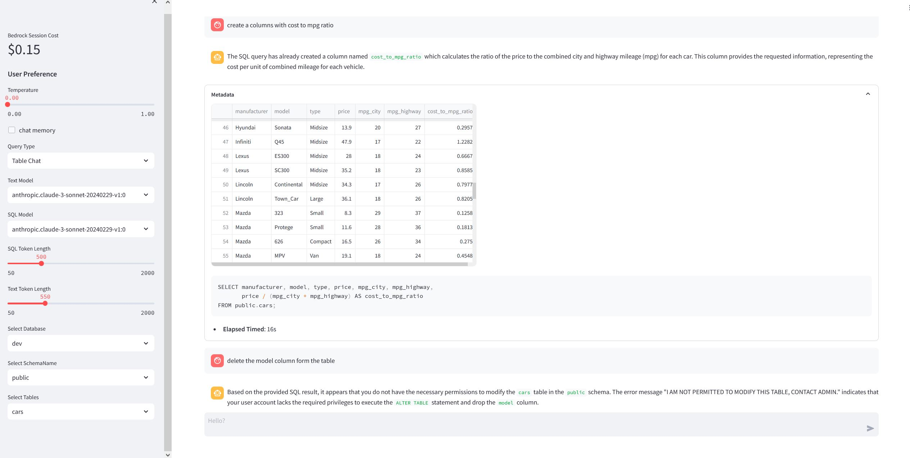

## Amazon Redshift Claude NL2SQL
This is a Streamlit application that allows users to interact with a Redshift database using natural language queries. The app leverages large language models (LLMs) to understand the user's query, generate SQL statements, execute them on the Redshift database, and present the results in a user-friendly manner.

### Features
- Natural Language Interface: Users can ask questions or provide prompts in natural language, and the app will generate the corresponding SQL queries.
- Redshift Integration: The app connects to a Redshift database cluster and executes the generated SQL queries to retrieve data.
- Result Visualization: Query results are displayed in a tabular format within the Streamlit app.
- Chat Interface: The app provides a chat-like interface for users to interact with the system, making it easy to follow the conversation flow.
- Memory Management: The app keeps track of the conversation history and can rephrase context-dependent questions to make them self-contained.
- Error Handling and Debugging: The app includes error handling and debugging capabilities, leveraging the LLM to suggest SQL query fixes in case of errors.
- Cost Estimation: The app provides an estimate of the cost incurred for using the LLM services (does not include cost of RedShift).

There are two files of interest.
1. A Jupyter Notebook that walks you through the Natural Language to SQL and back to Natural language implementation.
2. A Streamlit app that can be deployed to create a Chatbot to interface with the app.

### Pre-Requisites
1. [Amazon Bedrock Anthropic Claude Model Access](https://docs.aws.amazon.com/bedrock/latest/userguide/model-access.html)
2. [Amazon Redshift](https://docs.aws.amazon.com/redshift/latest/gsg/rs-gsg-launch-sample-cluster.html)

## To run this Streamlit App on Sagemaker Studio follow the steps below:

Configuration
Modify the following information in the **config.json** file:

- `redshift-identifier`: Identifier of the redshift cluster
- `database-name`: Redshift Database name
- `database-user`: Redshift Admin user name
- `serverless`: Boolean whether the Redshift Cluster is serverless or not (JSON booleans are all lower case eg."true" and not "True")
- `debug-max-retries`: Max number of iterations for LLM self-correction

If You have a sagemaker Studio Domain already set up, ignore the first item, however, item 2 is required.
* [Set Up SageMaker Studio](https://docs.aws.amazon.com/sagemaker/latest/dg/onboard-quick-start.html) 
* SageMaker execution role should have access to interact with [Bedrock](https://docs.aws.amazon.com/bedrock/latest/userguide/api-setup.html) and [Redshift](https://docs.aws.amazon.com/redshift/latest/mgmt/redshift-iam-access-control-identity-based.html). ⚠️**NOTE** Do not provide RedShift write permissions to the sagemaker execution role to prevent any unwanted altering of Database tables. A guard has been put within the logic to prevent this but I recommend to only allow necessary read rights to the execuion role the application uses. 
* [Launch SageMaker Studio](https://docs.aws.amazon.com/sagemaker/latest/dg/studio-launch.html)
* [Clone this git repo into studio](https://docs.aws.amazon.com/sagemaker/latest/dg/studio-tasks-git.html)
* Open a system terminal by clicking on **Amazon SageMaker Studio** and then **System Terminal** as shown in the diagram below
* 
* Navigate into the cloned repository directory using the `cd` command and run the command `pip install -r requirements.txt` to install the needed python libraries.
* Run command `python3 -m streamlit run redshift-llm.py` to start the Streamlit server. Do not use the links generated by the command as they won't work in studio.
* To enter the Streamlit app, open and run the cell in the **StreamlitLink.ipynb** notebook. This will generate the appropiate link to enter your Streamlit app from SageMaker studio. Click on the link to enter your Streamlit app.
* **⚠ Note:**  If you rerun the Streamlit server it may use a different port. Take not of the port used (port number is the last 4 digit number after the last : (colon)) and modify the `port` variable in the `StreamlitLink.ipynb` notebook to get the correct link.

### Usage

Use the sidebar to configure the app settings, such as the temperature for the LLM, whether to use chat memory, the query type (table or database), the LLM models to use for SQL generation and text generation, and the token lengths for SQL and text generation.
- **Database** query type would load all tables within that database schema
- **Table** query type would only query the selected table
- **chat memory** this option loads the chat memory into context and lets you ask follow up questions

Select the database, schema, and tables you want to query from the sidebar.

Start typing your natural language query in the chat input box, and the app will generate the corresponding SQL query, execute it on the Redshift database, and display the results.

The conversation history, metadata (such as elapsed time and SQL queries), and query results will be displayed in the chat interface.
⚠️**NOTE** Do not provide RedShift write permissions to the sagemaker execution role to prevent any unwanted altering of Database tables. A guard has been put within the logic to prevent this but I recommend to only allow necessary read rights to the execuion role the application uses. 

Contributing
Contributions to this project are welcome! If you find any issues or have suggestions for improvements, please open an issue or submit a pull request.

License
This project is licensed under the MIT License.
